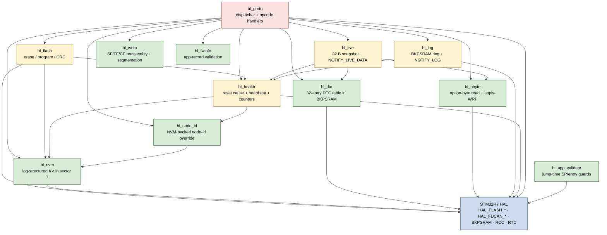
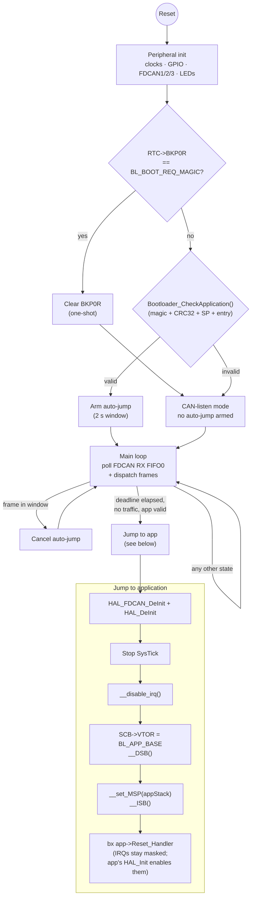

# Architecture

This document describes the canonical memory map, boot flow and
firmware contract for the STM32 CAN bootloader — the source of
truth that application firmware must honour to be flashed and
launched.

> **Scope convention.** This doc covers BL implementation + design
> rationale (memory layout, boot flow, flash / NVM / option-byte
> policy, BKPSRAM-backed DTC + log storage, session watchdog). The
> wire-level CAN protocol (frame IDs, ISO-TP PCI, opcodes, NACK
> codes, notification records) is specified in
> [can-flasher/REQUIREMENTS.md](https://github.com/isc-fs/can-flasher/blob/main/REQUIREMENTS.md);
> overlap here is cross-linked rather than duplicated.

---

## Scope and security model

The bootloader ships as an **internal tool** for closed-harness use
— lab benches, dev vehicles, private test rigs where physical
access to the CAN bus already implies authorisation.

**In scope at `v1.0.0`**: accidental corruption of the installed
image (caught by `FLASH_VERIFY`'s CRC32), accidental bootloader
overwrite (prevented by WRP once `OB_APPLY_WRP` has been issued),
session stalls on a crashed host (30 s session watchdog), observable
fault history for post-mortem (DTC table, log ring). **Out of
scope**: an attacker already on the bus pushing arbitrary firmware —
there is no image signature, session auth or transport encryption.
`CONNECT` is open to anyone speaking the protocol.

Cryptographic hardening (Ed25519 signing, replay counter,
challenge-response auth, AES-CTR transport) is **deferred at
`v1.0.0`** and documented as Phase 5 in [ROADMAP.md](ROADMAP.md).
It can be reactivated if the deployment model changes (public bus,
shared harness, regulated market — UN-R155, ISO/SAE 21434).

---

## Target hardware

**MCU / flash**: STM32H733ZGT6, 1 MB flash, 8 × 128 KB sectors,
single bank. **CAN**: classic CAN (no FD) on all three FDCANs at once —
FDCAN1 `PD0/PD1`, FDCAN2 `PB12/PB13`, FDCAN3 `PG10/PG9` (#120). The FDCAN
kernel clock is the **HSE**, and the 1 Mbps bit-timing assumes a **24 MHz
crystal** — a hard BOM requirement: a different crystal shifts the baud out
of tolerance, so a `_Static_assert` in `main.c` fails the build (#144).
**Status LEDs**: `OK_STATUS` on PD14, `ERR_STATUS` on PD15.

---

## Module map

Files in `Core/Src/bl_*.c` cluster into three layers. Lower layers
own pure data structures + HAL wrappers and don't call into peer
`bl_*` modules; the middle layer adds storage / diagnostic state;
the top layer orchestrates everything via the dispatcher. The diagram
is a simplification — `bl_log`, `bl_live` and `bl_health` also touch
the dispatcher for `NOTIFY_*` emission, so the boundary isn't strictly
acyclic at link time — but as a mental model for "what depends on
what" it captures intent.

---

## Flash memory map

All addresses are in the STM32 flash alias `0x0800_0000`.

| Sector | Start        | End          | Size   | Purpose                                  |
|:------:|--------------|--------------|:------:|------------------------------------------|
|   0    | `0x08000000` | `0x0801FFFF` | 128 KB | **Bootloader** — WRP-protected           |
|  1–6   | `0x08020000` | `0x080DFFFF` | 768 KB | **Application**                          |
|   7    | `0x080E0000` | `0x080FFFDF` | ≈128 KB – 32 B | **NVM** — log-structured KV store |
|        | `0x080FFFE0` | `0x080FFFFF` | 32 B   | Application metadata FLASHWORD           |

DTC storage and the log ring live in Backup SRAM (`0x38800000`),
not flash. Option-byte staging lives in the H7's option-byte
region. All flash constants used by the bootloader live in
[`Core/Inc/bl_memmap.h`](Core/Inc/bl_memmap.h); C code must never
re-declare them.

**Breaking change in Phase 4.** Carving sector 7 for NVM reduced
the maximum application image size from 896 KB to 768 KB; apps
below 768 KB continue to flash unchanged, but host tools and app
linker scripts that assumed the larger range need updating.

---

## Application metadata record

The bootloader refuses to launch any app without a valid metadata
record — a single FLASHWORD (32 bytes, eight `uint32_t` words) at
`BL_APP_METADATA_ADDR = 0x080FFFE0`, little-endian:

| Word | Field         | Notes                                                 |
|:----:|---------------|-------------------------------------------------------|
| 0    | `magic`       | `BL_APP_META_MAGIC = 0xB007C0DE`                      |
| 1    | `image_size`  | App size in bytes, starting at `BL_APP_BASE`          |
| 2    | `image_crc32` | IEEE-802.3 CRC32 (poly `0xEDB88320`, init/xor `0xFFFFFFFF`) over the first `image_size` bytes |
| 3    | `app_base`    | Must equal `BL_APP_BASE = 0x08020000`                 |
| 4    | `version`     | Host-defined firmware version word                    |
| 5–7  | reserved      | Zero; reserved for future fields                      |

The record is written by the bootloader itself during
`BL_CMD_WRITE_FINISH` after a CRC match. App images do not contain
the metadata word — the host flasher provides size, CRC and
version, and the bootloader stamps the record.

---

## Boot flow

Prose walk-through:

1. **Reset** — MCU starts the bootloader (vector table at
   `0x08000000`).
2. **Peripheral init** — clocks, GPIO, FDCAN1/2/3, status LEDs.
3. **Boot-request check** — read `RTC->BKP0R`. If it equals
   `BL_BOOT_REQ_MAGIC = 0xB00710AD`, clear it and stay in CAN-
   listen mode (the handshake an app uses to drop back in without
   JTAG). Otherwise call `Bootloader_CheckApplication()`, which
   validates every field of the metadata record (magic, size
   bounds, CRC recomputed over flash, app base) and the app's
   vector table (SP pointing to a valid RAM region, entry inside
   the app region). On success a 2-second auto-jump window is
   armed; any CAN frame received in that window cancels the jump.
4. **Main loop** — polls all three FDCAN RX FIFO0s and dispatches frames;
   the auto-jump fires when its deadline elapses with no inbound
   traffic.
5. **Jump to application** — deinit FDCAN and HAL, stop SysTick,
   disable IRQs, relocate `SCB->VTOR` to `BL_APP_BASE` (followed
   by `__DSB()` so the write is visible before any instruction
   fetch reads from the new vector table), restore MSP from the
   app's stack word (followed by `__ISB()` so the pipeline sees
   the new SP before the branch), and finally `bx` to the app's
   reset vector. **IRQs stay masked across the handoff** — the
   app's `Reset_Handler` / `HAL_Init()` is what re-enables them
   once it owns the CPU state. Re-enabling on the BL side risked
   a pending IRQ dispatching through the new VTOR before the
   app's reset handler had run; the barriers + masked-IRQs pattern
   are documented in ARM AN-298 and the AM32-bootloader reference
   implementation.

A corrupt or missing application never causes a blind jump — the
bootloader lights the error LED and stays in CAN-listen mode.

**Bootloader-request handshake (app → BL).** The app re-enters the
bootloader cleanly by writing `0xB00710AD` to `RTC->BKP0R` (backup
domain access must be enabled) and triggering a system reset. The
bootloader detects the magic, clears `RTC->BKP0R` so the request
is one-shot, and disables the auto-jump for that session.

---

## CAN protocol

Classic-CAN on all three FDCAN peripherals (FDCAN1/2/3) at once,
11-bit standard IDs, ≤ 8 B payload per
frame. Protocol constants live in
[`Core/Inc/bl_proto.h`](Core/Inc/bl_proto.h). Wire-level frame ID
layout, message-type byte, ISO-TP PCI shapes and the full opcode
table are specified in
[can-flasher/REQUIREMENTS.md § CAN protocol specification](https://github.com/isc-fs/can-flasher/blob/main/REQUIREMENTS.md#can-protocol-specification).
This section documents only what BL does on top of that contract.

### Multi-bus FDCAN — the BL serves all three at once

The BL runs its protocol on **FDCAN1, FDCAN2 and FDCAN3
concurrently**: at boot it installs the RX filters on, and starts,
every one; the main loop polls all three; and each reply is sent back
out the bus the request arrived on (`bl_fdcan_set_active` /
`bl_fdcan_get_handle` in
[`Core/Src/bl_fdcan.c`](Core/Src/bl_fdcan.c)). There is no instance to
select — one identical image works regardless of which FDCAN a board
wires CAN to.

**Why (deployment rationale).** The fleet runs several ECUs on a
*single shared CAN bus*, but — through a hardware mismatch — each board
taps that bus from a **different** FDCAN peripheral (one via FDCAN1,
one via FDCAN2, one via FDCAN3) rather than a common one. A
single-instance BL (say FDCAN2-only) can then only reach the ECU that
taps the bus through *its* peripheral; the others are invisible over
CAN and recoverable only via SWD — i.e. opening the sealed enclosure.
Serving all three lets one image reach every ECU on the bus no matter
which peripheral it uses, and stays correct if the hardware is later
re-spun onto a common peripheral.

Addressing on the shared bus is by **node ID** (next section): each ECU
is burnt with a distinct `BL_NODE_ID`, so a frame for one node is
filtered out by the others. The host enumerates every ECU with a
broadcast `DISCOVER` (the replies arbitrate by ID) and then flashes
each by its ID. Distinct IDs are mandatory — two ECUs sharing one would
collide on every reply.

Driving all three peripherals means the BL holds all three pin pairs
(`PD0/PD1` = FDCAN1, `PB12/PB13` = FDCAN2, `PG10/PG9` = FDCAN3) as CAN
on every board, so the *unused* pairs on a given board must be free
(the current fleet's are). A board that repurposed one of those pins
for another function would need that peripheral dropped from its build.
The `.ioc` keeps all three configured identically — notably
`AutoRetransmission = ENABLE` (the issue #94 fix) — and a boot-time
guard logs loudly if any bus comes up with it disabled, so a CubeMX
regeneration can't silently reintroduce the regression on one bus.

### Node ID provisioning and FDCAN filtering

Each board's 4-bit node ID has two possible sources:

1. **Compile-time `BL_NODE_ID`** in
   [`Core/Inc/bl_config.h`](Core/Inc/bl_config.h), set per board via
   `-DBL_NODE_ID=0x…`. The build asserts `0x1..0xE` (`0x0` is the
   host's reserved ID; `0xF` is broadcast). This is the fallback.
2. **NVM-backed override** under reserved key
   `BL_NVM_KEY_NODE_ID = 0x0001` in sector 7. When present and
   valid, this overrides the compile-time default. That lets the
   same firmware image be provisioned to many boards from the host
   side without a rebuild + SWD reflash — see
   [`PROVISIONING.md §3`](PROVISIONING.md#3-changing-the-node-id-via-nvm-v130).

Resolution happens once during `Bootloader_Init`, in
`bl_node_id_init_from_nvm()`
([`Core/Src/bl_node_id.c`](Core/Src/bl_node_id.c)), immediately
after `bl_nvm_init()` and **before** the FDCAN filter is
configured. The cached resolved ID is exposed by
`bl_node_id_get()`, which is the single source of truth for every
site that needs the ID: the FDCAN RX filter, the dispatcher's
`bl_proto_addressed_to_us`, every TX frame ID build, the DISCOVER
reply, and the heartbeat's node-id byte. Reads from `bl_node_id_get`
are safe from RX IRQ context (single static byte load).

Validation on the NVM-stored byte is intentionally strict — any
malformed entry silently falls back to the compile-time
`BL_NODE_ID` rather than refusing to boot. The fallback is always
known-good (the build asserts it), so a bad override should never
make a board unrecoverable. Rejection cases:

- value length ≠ 1 byte
- byte == `0x00` (host's reserved ID)
- byte == `0x0F` (broadcast pseudo-node — a node responding from
  it would race every reply on the bus)
- byte ∈ `0x10..0xFF` (out of the 4-bit destination field; the
  FDCAN mask would silently truncate to an unrelated low nibble)

Two classic-mask FDCAN filters are then installed on FIFO0 of **every
bus** (see *Multi-bus FDCAN* above): `dst == bl_node_id_get()`
(unicast) and `dst == 0xF` (broadcast).
Non-matching standard IDs, non-matching extended IDs and all remote
frames are rejected at the peripheral and never reach software. The
dispatcher keeps a defence-in-depth `bl_proto_addressed_to_us`
check so any future software-routed path stays honest.

A new node-id override only takes effect on the next boot — the
filter is built once at init and not re-applied at runtime.
Hot-swapping a node's identity mid-session would silently
desynchronise the host's filter state, which is far worse than the
operator having to reboot once.

### ISO-TP transport (BL-side policy)

Wire-level FF/CF/FC shapes are in
[REQUIREMENTS.md § Multi-frame (ISO-TP)](https://github.com/isc-fs/can-flasher/blob/main/REQUIREMENTS.md#multi-frame-iso-tp).
BL-side rules layered on top: **max reassembled message size
1024 B** (`BL_ISOTP_MAX_MSG` in
[`Core/Inc/bl_isotp.h`](Core/Inc/bl_isotp.h); the ISO 15765 32-bit
escape FF is explicitly not supported and yields
`NACK(BL_NACK_TRANSPORT_ERROR)`); **flow control is unconditional
`FC(CTS, BS=0, STmin=0)`** on every FF (no backpressure yet — the
request/response pattern keeps the host from needing to send
anything during a synchronous handler, notably `FLASH_ERASE`);
**single 1 s total-elapsed reassembly timeout** between FF and
completion (ISO 15765's separate N_Bs / N_Cr timers collapse into
this one; expiry → `NACK(BL_NACK_TRANSPORT_TIMEOUT)` and
reassembler → IDLE); **only one reassembly in flight** (a new FF or
SF arriving mid-reassembly discards the in-flight buffer and starts
fresh). Any malformed PCI, out-of-order CF, unexpected CF with no
FF active, or declared length over 1024 B produces
`NACK(BL_NACK_TRANSPORT_ERROR)`.

### Opcodes

Opcode table, payload shapes and session-gating column are in
[REQUIREMENTS.md § Command opcodes](https://github.com/isc-fs/can-flasher/blob/main/REQUIREMENTS.md#command-opcodes-source-bl_protoh).
What follows is only BL-side semantics not obvious from the wire.

#### CONNECT / DISCONNECT / DISCOVER

**CONNECT** checks the host's major-version byte against its own
and rejects a mismatch with `NACK(BL_NACK_PROTOCOL_VERSION)`
**before** touching any session state — a failed handshake cannot
arm the watchdog or flip the latch. On success the **session
latch** goes active and the watchdog is armed. **DISCONNECT**
clears the latch; an MCU reset or watchdog timeout also clears it.

**DISCOVER** is deliberately answered with a short Single-Frame
reply so a bus scan stays cheap; hosts that want the full identity
record follow up with `GET_FW_INFO` on the specific node.
**GET_FW_INFO** is not session-gated — identity is readable
anytime. No valid app installed → `NACK(BL_NACK_NO_VALID_APP)`;
app valid but lacks a firmware-info record →
`NACK(BL_NACK_UNSUPPORTED)`.

#### Firmware-info record (app-owned)

Byte layout and host-side C snippet are in
[REQUIREMENTS.md § Fixed-layout records](https://github.com/isc-fs/can-flasher/blob/main/REQUIREMENTS.md#fixed-layout-records).
BL-side: the record lives at `BL_APP_BASE + 0x400 = 0x08020400` —
the 0x400 offset clears an H7-sized vector table with margin (app
code typically starts at `0x500` or later). Apps must pin the
record's section to this exact address in their linker script; the
bootloader reads it by fixed offset, not by symbol, and never
writes to this region — it's owned end-to-end by the app.

**Compatibility rule.** The bootloader accepts any record whose
magic matches **and** whose `record_version` major is ≥ 1. Minor
revisions keep the layout compatible; a major bump is an explicit
break.

#### GET_HEALTH + NOTIFY_HEARTBEAT

The 32-byte health record and 7-byte heartbeat payload are in
[REQUIREMENTS.md § Unsolicited notifications](https://github.com/isc-fs/can-flasher/blob/main/REQUIREMENTS.md#unsolicited-notifications-type--notify-dst--host)
and the fixed-layout records section. BL-side policy:
**heartbeat emits at 1 Hz while a session is active and is silent
otherwise** (idle bootloaders on a multi-node bus shouldn't flood
the wire with heartbeats going nowhere); **reset cause is latched
once from `RCC->RSR`** at the start of `Bootloader_Init`, which
then clears `RCC->RSR` so the next reset starts clean — conflict
resolution favours fault causes over normal causes so dual-
condition scenarios still surface the more actionable code.
**`GET_HEALTH` is not session-gated** so hosts can poll it before
`CONNECT` to decide which node to talk to.

##### Reset cause values

`RCC->RSR` bit → `BL_RESET_*` mapping:

| Value  | Name                 | `RCC_RSR` source                         |
|:------:|----------------------|------------------------------------------|
| `0x00` | `BL_RESET_UNKNOWN`   | No recognised flag set                   |
| `0x01` | `BL_RESET_POWER_ON`  | `PORRSTF` — fresh power                  |
| `0x02` | `BL_RESET_PIN`       | `PINRSTF` — NRST line                    |
| `0x03` | `BL_RESET_SOFTWARE`  | `SFTRSTF` — `NVIC_SystemReset()`         |
| `0x04` | `BL_RESET_IWDG`      | `IWDG1RSTF` — independent watchdog       |
| `0x05` | `BL_RESET_WWDG`      | `WWDG1RSTF` — window watchdog            |
| `0x06` | `BL_RESET_LOW_POWER` | `LPWRRSTF`                               |
| `0x07` | `BL_RESET_BROWNOUT`  | `BORRSTF`                                |

The `BL_HEALTH_FLAG_*` bitmask specified in REQUIREMENTS currently
has bits 0 (session active), 1 (valid app present) and 4 (WRP
protected) live; other bits are reserved for later phases.

#### DTC table

DTCs live in a table in **Backup SRAM** at `0x38800000`: 32 entries
× 20 bytes + 16-byte header = 656 bytes, leaving ~3.4 KB of BKPSRAM
for later phases. On-wire `DTC_READ` / `DTC_CLEAR` / `NOTIFY_DTC`
shapes are in REQUIREMENTS.

**Why BKPSRAM** (not flash): DTCs are "faults seen since last
clear", not a permanent audit log. Backup SRAM survives soft resets
and watchdog fires — the exact situations where a crash-causing DTC
is most valuable — but is lost on power loss unless the board has
a coin cell on `V_BAT`. No flash wear, no rotating-sector
bookkeeping. A permanent audit log is a Phase 5+ concern.

**Dedup** bumps an entry's `occurrence_count` (saturating at 255)
and refreshes `last_seen_uptime_seconds`. **No `NOTIFY_DTC` fires
on dedupes** — a chatty persistent fault would otherwise flood the
bus. **Eviction**: when a 33rd distinct code arrives the oldest
entry (slot 0) is evicted and the rest shift down.

**BL-emitted well-known codes:** `0x0010` `BL_DTC_FLASH_HW` (error;
context = failing flash address), `0x0020`
`BL_DTC_SESSION_TIMEOUT` (warn; context = 0). Apps and future
phases allocate their own codes above `0x0100`.

**Persistence across the BL → app jump.** BKPSRAM is not cleared
at jump time and the app doesn't touch the DTC region today, so on
the bootloader's next run the table is recovered as-is and
`DTC_READ` returns the full history. Only `DTC_CLEAR` and a power
cycle (without backup battery) empty the table.

#### Log streaming

**1 KB printf-style log ring in Backup SRAM** at `0x38800400`
(right after the DTC table). Ring contents survive soft resets,
watchdog fires, and the BL → app jump, so a host that reconnects
after a crash can `LOG_STREAM_START` and replay the last ~1 KB
leading up to the reboot.

**Entry format** (same in the ring and inside `NOTIFY_LOG`): a
6-byte header `[len_u8, severity_u8, uptime_le32]` followed by
`len` bytes of UTF-8 text (not NUL-terminated on the wire), up to
120 bytes per entry. Entries pack back-to-back and a single entry
can straddle the end-of-buffer boundary.

**Overflow.** When a new entry doesn't fit, oldest entries are
evicted one at a time until there's room. A running counter of
evicted bytes is kept and, on the next drain, a **synthetic marker
entry** (`<LOG_OVERFLOW N bytes dropped>`, severity=warn) is
prepended to the output. The marker is formatted on the fly and
never lives in the ring, so the host always sees a breadcrumb for
lost data.

**Drain budget.** `bl_log_tick` runs every main-loop iteration; if
streaming is active and ≥ `BL_LOG_MIN_EMIT_INTERVAL_MS` (default
50 ms) has elapsed, up to `BL_LOG_DRAIN_BUDGET` bytes (default
256) are shipped as one `NOTIFY_LOG`. The rate limit caps log
traffic at ~20 frames/s ≈ 5 KB/s even when the ring is full.

**Severity filter.** `LOG_STREAM_START` carries a `min_severity`
byte; entries below it are **consumed from the ring but not
emitted** — once you pick a verbosity, anything below it is gone
for good. Verbosity is a host-side choice applied at drain time.

**BL-side call sites** wired today: `bl_log_info` on boot-up (with
the latched reset cause) and on `CONNECT` (records host protocol
version); `bl_log_info` / `_warn` / `_error` bracketing
`FLASH_ERASE`; `bl_log_warn` on session watchdog timeout.

#### Live-data streaming

Where `GET_HEALTH` is an on-demand snapshot of coarse state,
`NOTIFY_LIVE_DATA` is a push stream at 1..50 Hz carrying a 32-byte
snapshot of bootloader-internal counters and current-state
pointers — intended for host-side live-table / plot views during a
flash session. Snapshot byte layout is in
[REQUIREMENTS.md § Fixed-layout records](https://github.com/isc-fs/can-flasher/blob/main/REQUIREMENTS.md#fixed-layout-records).

**Rate bounds.** Values outside `[BL_LIVE_MIN_RATE_HZ = 1,
BL_LIVE_MAX_RATE_HZ = 50]` yield `NACK(BL_NACK_UNSUPPORTED)`. The
50 Hz ceiling keeps live-data over a 500 kbps bus under ~6 %
utilisation; the 1 Hz floor is a deliberate nudge to poll
`GET_HEALTH` instead when that cadence is enough.

**App-side live data** is future work — most likely a fixed RAM
region the app writes to that the bootloader proxies on a separate
opcode so the two streams don't interleave. The snapshot struct
is the single source of truth on the device side; bumping it is a
breaking change.

#### FLASH_ERASE / FLASH_WRITE / FLASH_READ_CRC / FLASH_VERIFY

All four operate on the writable app range `[BL_APP_BASE,
BL_APP_END + 1) = [0x08020000, 0x080E0000)` (sectors 1–6 after
Phase 4). Addresses outside the range earn
`NACK(BL_NACK_OUT_OF_BOUNDS)` or `NACK(BL_NACK_PROTECTED_ADDR)`
(when they overlap bootloader / NVM / metadata); flash HW errors
surface as `NACK(BL_NACK_FLASH_HW)`.

**FLASH_ERASE is synchronous.** It blocks in `HAL_FLASHEx_Erase`
for the full erase duration (typically 1–4 s per 128 KB sector on
H7) and only ACKs when done. Frames arriving during the erase queue
in FDCAN FIFO0 (depth 16) and drain after the handler returns. A
real `FC(Wait)` backpressure mechanism is deliberately **not**
implemented — the request/response pattern keeps the host from
needing to send anything during an erase. `start` and `length`
must be multiples of `BL_FLASH_SECTOR_SIZE` (128 KB).

**FLASH_WRITE alignment / single-program constraint.** `addr` must
be FLASHWORD-aligned (32 bytes); a trailing partial FLASHWORD is
padded with `0xFF` internally. Each FLASHWORD can be programmed
only once between erases — this is the **H7 ECC constraint**, not
a policy — so the host must erase the target sectors before
writing.

**FLASH_READ_CRC** is read-only but still session-gated.

**FLASH_VERIFY** recomputes CRC32 over `[BL_APP_BASE, BL_APP_BASE +
expected_size)`. On match it writes the metadata FLASHWORD at
`BL_APP_METADATA_ADDR` as a **side effect of verification** —
pairing the two keeps "image is good" and "image is launchable"
atomic from the host's point of view. On mismatch:
`NACK(BL_NACK_CRC_MISMATCH)` and the metadata FLASHWORD remains
erased, so `Bootloader_CheckApplication` rejects the image on next
boot. The metadata sector must have been erased previously (usually
by a `FLASH_ERASE` covering sector 7); otherwise the program call
fails with `NACK(BL_NACK_FLASH_HW)`.

#### RESET modes

`mode` byte picks what "reset" means:

| `mode` | Effect                                                       |
|--------|--------------------------------------------------------------|
| `0x00` | Hard reset via `NVIC_SystemReset()`                          |
| `0x01` | Soft reset — identical to 0x00 on this family                |
| `0x02` | Write `BL_BOOT_REQ_MAGIC` to `RTC->BKP0R`, then reset — the handshake holds the next boot in listen mode |
| `0x03` | Direct jump to the installed application (no reset)          |

Mode 3 is validated **before** the ACK — if
`Bootloader_CheckApplication` rejects the installed image the host
gets `NACK(BL_NACK_NO_VALID_APP)` and the bootloader stays in
listen mode. Modes 0–2 always ACK first, then trigger the reset.

#### JUMP

Jumps directly to `addr_le32`. Phase-2 policy: the address must
equal `BL_APP_BASE` and the installed app must pass integrity
checks. Out-of-range → `NACK(BL_NACK_OUT_OF_BOUNDS)`; corrupt or
missing app → `NACK(BL_NACK_NO_VALID_APP)`.

#### NVM store

**Log-structured key-value store in flash sector 7**, running from
`0x080E0000` up to (but not including) the app metadata FLASHWORD
at `0x080FFFE0`. That leaves `BL_NVM_SIZE = 128 KB − 32 B`, enough
for ≈4095 entries before compaction. Both opcodes are **session-
gated**: NVM is bootloader administration, not something random
hosts should poke.

**Why log-structured.** Each FLASHWORD can be programmed only once
between erases (H7 ECC constraint), so an in-place key-value scheme
is out. Writes append a fresh 32-byte FLASHWORD tagged with
`seq = max_seen + 1`; reads are a linear scan returning the
highest-seq entry for the key, or `NVM_NOT_FOUND` when the latest
entry is a tombstone (`len == 0`).

**Compaction algorithm.** When the sector fills, the next
`bl_nvm_write` triggers **in-place compaction**: (1) scan and dedup
to the latest live entry per key into a RAM buffer
(`BL_NVM_MAX_LIVE_ENTRIES = 128` unique keys cap); (2) snapshot
the app metadata FLASHWORD into RAM; (3) erase sector 7; (4) re-
program the live entries at the head of the sector with fresh
`seq` values 1..N; (5) program the new incoming write as entry
N+1; (6) program the metadata FLASHWORD back to `0x080FFFE0`. If
step 6 fails or power is lost between 3 and 6 the metadata is left
erased and `Bootloader_CheckApplication` rejects the app on next
boot — recoverable by re-flashing. A ping-pong two-sector scheme
would eliminate that window if stronger guarantees are ever
required.

**Reserved keys** live below `0x1000`; user / app keys start at
`0x1000`. Today:

| Key      | Name                            | Notes                                                |
|---------:|---------------------------------|------------------------------------------------------|
| `0x0001` | `BL_NVM_KEY_NODE_ID`            | 1-byte override for compile-time `BL_NODE_ID`        |
| `0x0002` | `BL_NVM_KEY_CAN_BITRATE`        | reserved — future CAN bitrate preference             |
| `0x0003` | `BL_NVM_KEY_FLASH_WRITE_COUNT`  | 4-byte lifetime counter of `bl_flash_{write,erase}` ops, persisted across boots and exposed in the `flash_write_count` field of the health record |

#### Option bytes (OB_READ, OB_APPLY_WRP)

H7 option bytes control write-protection (WRP), read-protection
level (RDP), brown-out reset, and user-config flags. BL owns two
opcodes over this surface.

**Mask inversion.** The on-wire `wrp_sector_mask` follows the
**HAL convention** (bit set = protected), not the underlying
`FLASH_WPSN_CUR1R` register (bit clear = protected); BL converts on
the way out. **`OB_READ` is not session-gated** so a provisioning
UI can decide up-front whether to issue `OB_APPLY_WRP`.

**`OB_APPLY_WRP` is session-gated and token-gated.** The first 4
args bytes must be the ASCII-LE token
`BL_OB_APPLY_TOKEN = 0x00505257` ("WRP\0"); a missing or
mismatched token produces `NACK(BL_NACK_OB_WRONG_TOKEN)` with no
side effects. The token is a deliberate **brick-safety belt**: on
recent H7 silicon WRP can only be cleared via a full chip erase
through an external debugger, so an accidental apply during
development would brick the part until it can be put on a
programmer. Optional bytes 4..7 carry a LE sector bitmap; omitted,
it defaults to `0x01` (protect sector 0 — the bootloader — only).

**Launch sequencing.** On a valid request the handler ACKs
synchronously, then **polls the FDCAN TX FIFO until it has fully
drained** (`HAL_FDCAN_GetTxFifoFreeLevel == BL_FDCAN_TX_QUEUE_DEPTH`,
with a 50 ms timeout fallback), and only then calls
`bl_obyte_apply_wrp()` which unlocks the OB area, programs the new
WRP mask, and calls `HAL_FLASH_OB_Launch()`. The earlier `HAL_Delay(10)`
"let the ACK drain" pattern was hope, not guarantee — a long CF
chain queued ahead or a low CAN bitrate could leave the ACK in the
FIFO when the MCU reset and the host would never see it.

The launch itself resets the MCU, so the handler does not return on
success. If the launch ever returns (a documented edge case on some
families — usually means `HAL_FLASH_OB_Unlock` or
`HAL_FLASHEx_OBProgram` failed before the launch ever ran, so the
option bytes weren't touched) the handler logs `BL_DTC_FLASH_HW`
and surfaces the failure through the DTC table — **but does NOT
emit a NACK**, because the host already received a positive ACK
above and a contradictory NACK arriving afterwards would violate
the protocol's at-most-one-response-per-CMD invariant. The host
detects the no-op via session-watchdog timeout (the BL is hung in
the failed handler) and verifies via `OB_READ` on the next
reconnect that the option bytes are unchanged.

**Boot-time self-check.** `Bootloader_Init` calls
`bl_obyte_is_sector_wrp_protected(0)`; if sector 0 isn't
protected, a warning (`WRP: bootloader sector 0 not write-
protected; run OB_APPLY_WRP to latch`) goes into the log ring. The
same check drives `BL_HEALTH_FLAG_WRP_PROTECTED` and
`BL_LIVE_FLAG_WRP_PROTECTED`, so a host can gate its apply
decision on the flag without polling `OB_READ` first.

**RDP policy.** This project deliberately **reads** the RDP level
but has **no code path that writes it**. RDP is set out-of-band —
see [PROVISIONING.md § 3](PROVISIONING.md#3-rdp-policy). Dev
boards stay at Level 0, production units get Level 1 via
STM32CubeProgrammer at provisioning time, **Level 2 is forbidden**
(one-way trip that bricks the debug surface permanently). Keeping
RDP out of the CAN-reachable surface is intentional: a misfiring
host tool cannot transition a unit into Level 2 because the
firmware cannot emit the instruction that would do it.

### Session watchdog

```mermaid
stateDiagram-v2
    [*] --> Idle: reset
    Idle --> Active: CMD_CONNECT (host major == BL major)
    Idle --> Idle: any other addressed frame<br/>(NACK if needed; no latch flip)

    Active --> Active: addressed frame OR ACK emitted<br/>(refresh activity timestamp)
    Active --> Active: 1 Hz heartbeat tick<br/>(NOTIFY_HEARTBEAT)
    Active --> Idle: CMD_DISCONNECT
    Active --> Idle: watchdog (30 s silence)<br/>→ try auto-jump if app valid
    Active --> [*]: NVIC_SystemReset()<br/>(CMD_RESET / OB_APPLY_WRP)
```

Once `CONNECT` succeeds the bootloader arms a watchdog that fires
after `BL_SESSION_TIMEOUT_MS` (default **30 000 ms**, override with
`-DBL_SESSION_TIMEOUT_MS=…`) of silence. Idle bootloaders that have
never seen a `CONNECT` are not watchdogged.

**What counts as activity.** The last-activity timestamp is
refreshed by (1) any addressed frame passing the FDCAN filter and
the TYPE / PCI gate in `bl_proto_dispatch` — NACKed frames count
too, since a host still transmitting unsuccessfully is still alive;
and (2) every ACK the bootloader transmits. The second rule keeps
long synchronous handlers (notably `FLASH_ERASE`, which can block
for several seconds inside `HAL_FLASHEx_Erase`) from appearing dead
on the first tick after they finally reply.

**What a timeout does.** On expiry the bootloader clears the
session latch, resets the ISO-TP reassembler, then tries to auto-
jump to the installed application via `Bootloader_CheckApplication`
+ `Bootloader_JumpToApplication`. Valid app → jump (the host-
abandoned window is treated like a stretched post-boot auto-jump);
corrupt / missing app → stay in listen mode and let a fresh
`CONNECT` re-arm the session. No NACK or NOTIFY is sent on timeout.

**Keepalive.** The host sends `CMD_CONNECT` every 5 s during long
operations to keep the watchdog armed. `CMD_CONNECT` was chosen
over a dedicated keepalive opcode so there's only one session-
management surface to reason about; ~10 bytes every 5 s is
negligible on a 500 kbps bus.

### NACK codes

For the full NACK enum (values, names, and trigger conditions) see
[REQUIREMENTS.md § NACK error codes](https://github.com/isc-fs/can-flasher/blob/main/REQUIREMENTS.md#nack-error-codes-source-bl_protoh).
Codes are defined in `Core/Inc/bl_proto.h` and mirrored on the host.

### Protocol branch coverage

Short history of feature branches; tags mark the phase-closing
dev→main merges. **Phase 2 — `v0.2.0-protocol`**:
`feat/5-frame-layout`, `feat/6-isotp`, `feat/7-core-opcodes`
(`CONNECT`/`DISCONNECT`/`DISCOVER`/`RESET`/`JUMP`),
`feat/8-flash-opcodes` (`FLASH_*` + session gating),
`feat/9-session-timeout` (30 s watchdog + keepalive).
**Phase 3 — `v0.3.0-diagnostics`**: `feat/10-firmware-info`,
`feat/11-heartbeat-health` (heartbeat + `GET_HEALTH` + reset-cause
latch), `feat/12-dtc`, `feat/13-log-stream`, `feat/14-live-data`.
End of Phase 3 the bootloader is a fully observable node.
**Phase 4 — `v0.4.0-config`**: `feat/15-nvm` (sector 7; app region
shrinks to 768 KB), `feat/16-wrp-option-bytes` (`OB_READ`,
`OB_APPLY_WRP`, WRP self-check on boot).

---

## RAM usage (bootloader)

**DTCMRAM** `0x20000000`–`0x2001FFFF` holds the bootloader stack
(top = `0x20020000`); **RAM_D1** `0x24000000`–`0x2404FFFF` holds
`.data` / `.bss` / heap. The app is free to place its own stack /
data in any of the H7 RAMs; the bootloader's SP sanity check at
jump time accepts a DTCM or RAM_D1 stack pointer and will be
extended as new SRAM regions come into use.

---

## Future work (not implemented)

**Phase 5 — security** (deferred at `v1.0.0`). Planned work stays
on [ROADMAP.md](ROADMAP.md) with a `⏸ deferred` badge so the on-
ramp is preserved. Sketch (counters assigned at branch-cut time —
the `feat/N` numbering in early drafts of this doc has since been
consumed by other work):

- **Image signing.** 64-byte Ed25519 signature record near
  `0x080FFF00`, boot-time verify against a bootloader-embedded
  public key, `BL_NACK_SIGNATURE_INVALID` on mismatch.
- **Replay counter.** Monotonic `min_fw_version` persisted in a
  new NVM key (the existing `0x0003` is now used for the flash-op
  counter, so this work picks a fresh key); `FLASH_VERIFY` rejects
  downgrades.
- **Challenge–response.** Nonce in the `CONNECT` ACK + new
  `CMD_AUTH` opcode carrying a Blake2b-MAC.
- **Encrypted transport.** Optional AES-128-CTR wrapping of ISO-TP
  payloads behind a build-time feature flag.

**Other deferred work.** Rollback slots (A/B) — a second app
region for safe-update semantics; would require re-sizing sector 7
NVM or reclaiming flash from the existing app region.

Each item will carve (or reclaim) its own region from the current
memory map and will be documented here as it lands.
