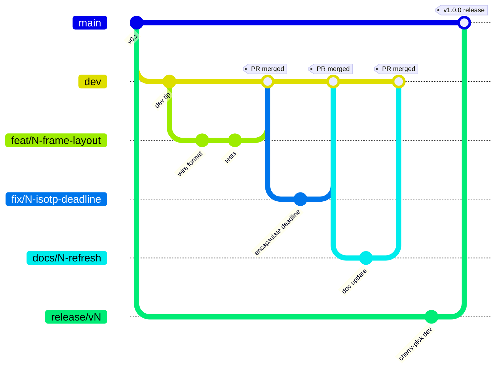

# Contributing to the STM32 CAN bootloader

Conventions for working on the bootloader firmware itself — branch
naming, review process, CI hooks. If you just want to flash boards
or diagnose a brick in the pit, you want
[PROVISIONING.md](PROVISIONING.md) instead.

---

## Setup

1. GitHub account + clone this repo:
   - SSH: `git@github.com:isc-fs/stm32-can-bootloader.git`
   - HTTPS: `https://github.com/isc-fs/stm32-can-bootloader.git`
2. Toolchain: ARM GCC + CMake + Ninja (STM32CubeIDE ships all three;
   a standalone install works too). Verify with `cmake --preset
   Debug && cmake --build build/Debug` — should produce
   `build/Debug/CAN_BL.elf` with no warnings.
3. First-time Git users: [git-scm.com's official tutorial](https://git-scm.com/docs/gittutorial)
   covers everything needed below.

---

## Branches



- **`main`** — production. Carries released, bench-validated firmware
  only. Don't work here. Required-status-check protected; releases are
  cut onto a `release/vX.Y.Z` branch off `main` (see [Merging to
  main](#merging-to-main-release-cut)), never by merging `dev` in
  directly.
- **`dev`** — integration. Don't work here either. Required-status-
  check protected; every `feat/fix/docs` branch PRs into it.
- **Feature / fix / docs branches** are cut from `dev`, PR'd back to
  `dev`, reviewed, merged, deleted. Three name formats, both with a
  short kebab-case title so the branch purpose is visible at a glance:

  ```
  feat/<n>-<short-title>   → new functionality
  fix/<n>-<short-title>    → bug fix
  docs/<n>-<short-title>   → documentation changes only
  ```

  Counters are **independent per-type** (`feat/5-…` and `fix/5-…`
  can coexist; `docs/1-…` is the first docs branch ever). Pick the
  next number by filtering issues by label and looking at the
  highest closed one — or run
  `git log --all --pretty=format:'%s' | grep -oE '<type>/[0-9]+' | sort -V | tail -1`.

## The tracking issue

Every branch gets an auto-created GitHub issue carrying:
- The full branch name in the title: `[feat/3-xyz] ...`
- The matching label (`feat` / `fix` / `docs`)
- A template description

A GitHub Actions workflow creates the issue on first push. If the
number is off-by-one (too high or too low), the workflow comments a
warning so you can rename before anyone else sees. The first commit
message you push auto-fills the issue description; edit by hand to
fix-up.

**Closing**: the issue closes automatically when its PR merges.
Issues are the permanent record of what each branch did — to see
past work, filter by label + state=closed.

---

## Workflow

```bash
# 1. Up-to-date dev
git checkout dev && git pull origin dev

# 2. Cut the branch (replace number + title)
git checkout -b feat/5-frame-layout

# 3. Push — triggers issue creation
git push origin feat/5-frame-layout

# 4. Work, commit, push as usual
git add <files>
git commit -m "short, imperative description"
git push

# 5. PR toward dev via gh or the web UI
gh pr create --base dev
```

In the PR description, include `Closes #<issue-number>` so merge
closes the tracking issue automatically.

**Before requesting review**, check:
- `cmake --build build/Release` is clean (no warnings, no link errors).
- You ran the change on bench if it touches anything wire-format,
  flash-programming, or session-state. If hardware was involved,
  say what you tested in the PR body.
- The PR targets `dev`, not `main`.

## Merging to main (release cut)

Only when `dev` holds a set of validated changes and someone with
bench access has signed off on a full flash-cycle test
([RELEASE_BENCH.md](RELEASE_BENCH.md) is the checklist).

Releases are **cut onto a dedicated branch off `main` and built from
cherry-picks** — `dev` is never merged into `main` directly:

```bash
# 1. Branch off the current main
git fetch origin
git checkout -b release/vX.Y.Z origin/main

# 2. List dev's commits that aren't on main yet, then cherry-pick them
#    (oldest first). Use `git cherry`, NOT a tag range: dev and main
#    share no SHAs (see below), so `vPREV..dev` would match the whole
#    branch. `+` marks a commit that still needs a cherry-pick.
git cherry -v origin/main origin/dev
git cherry-pick <sha1> <sha2> ...

# 3. Bump the version in bl_proto.h so host tools see the change
#    (BL_PROTO_VERSION_MINOR for compatible changes, MAJOR for breaking)

# 4. Open the release-cut PR; merge once CI + the bench checklist pass
gh pr create --base main --head release/vX.Y.Z

# 5. Tag the merge commit and publish the GitHub Release
git tag vX.Y.Z <merge-commit-sha>
git push origin vX.Y.Z
```

### `dev` and `main` diverge on purpose

Because each release is built from cherry-picks, every released commit
exists twice: the original on `dev` and a re-applied copy on `main`
with a different SHA. The two branches therefore share no recent
history — both `git log origin/main..origin/dev` and `git log
origin/dev..origin/main` are non-empty and grow with every release —
while their **trees stay identical** (`git diff origin/dev origin/main`
is empty). This SHA divergence is expected and harmless; **don't try to
reconcile it.**

There is deliberately **no** automated `dev`↔`main` sync. A former
`sync-dev-after-release.yml` workflow tried to fast-forward `dev` to
`main` on every release — it could never succeed (branch protection
requires a PR into `dev`) and, even if forced through, would have
pulled `main`'s duplicate cherry-pick commits back into `dev` and
mangled its history. It was removed. If you're tempted to bring it
back, re-read this section.

---

## Where things live

- `Core/Src/bl_proto.c` — protocol dispatch, ISO-TP glue, session
  latch, opcode handlers. The hot path.
- `Core/Src/bl_flash.c` — HAL wrapper for erase / program / CRC
  with the range-checks that enforce the bootloader's self-protection.
- `Core/Src/bl_isotp.c` — ISO-TP reassembler, HAL-free, unit-testable.
- `Core/Src/bl_*.c` — health, DTC, log, live-data, NVM, option-byte
  modules. Each with a matching `.h` that's the public surface.
- `Core/Src/main.c` — CubeMX-managed init + the main dispatch loop.
  Hand-edited code lives in `USER CODE BEGIN/END` blocks per CubeMX
  convention.

See [`ARCHITECTURE.md`](ARCHITECTURE.md) for the full memory map,
boot flow, and opcode-by-opcode design rationale.

## Wire-format changes

If your change touches the CAN protocol (opcodes, ID layout, ISO-TP
framing, msg-type byte) you need matching changes in the host tool
(`isc-fs/can-flasher`) because they share the protocol. Coordinate
via linked PRs — the flasher side holds the spec
(`can-flasher/REQUIREMENTS.md`), this side implements it. Bump
`BL_PROTO_VERSION_MINOR` on backward-compatible changes,
`BL_PROTO_VERSION_MAJOR` on breaking ones.

---

*ISC Racing Team — IFS08 Driverless*
