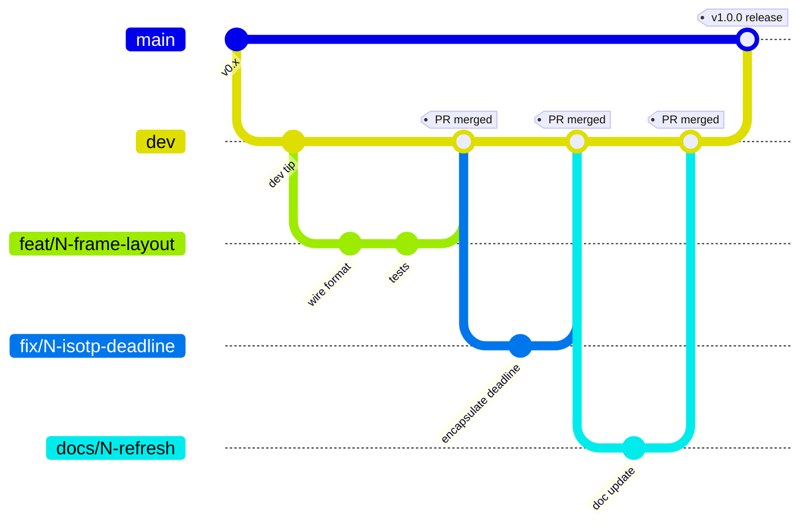

# Contributing to the STM32 CAN bootloader

Conventions for working on the bootloader firmware itself — branch
naming, review process, CI hooks. If you just want to flash boards
or diagnose a brick in the pit, you want
[PROVISIONING.md](PROVISIONING.md) instead.

---

## Setup

1. GitHub account + clone this repo:
   - SSH: `git@github.com:isc-fs/stm32-can-bootloader.git`
   - HTTPS: `https://github.com/isc-fs/stm32-can-bootloader.git`
2. Firmware toolchain: ARM GCC (`arm-none-eabi-gcc`) + CMake + Ninja
   (STM32CubeIDE ships all three; a standalone install works too). Verify with
   `cmake --preset Debug && cmake --build build/Debug` — should produce
   `build/Debug/CAN_BL.elf` with no warnings. (A `cmake/starm-clang.cmake`
   toolchain exists for the sector-0 build but is **not** CI-exercised — verify
   the link by hand if you ship from it.)
3. Host-test toolchain (the faster inner loop, and the actual merge gate): a host
   C compiler + CMake + Ninja; Unity is auto-fetched on first configure (one-time
   network). See *Testing* below.
4. First-time Git users: [git-scm.com's official tutorial](https://git-scm.com/docs/gittutorial)
   covers everything needed below.

---

## Branches



- **`main`** — production. Only merges from `dev` after full bench
  validation. Don't work here. Required-status-check protected;
  `dev → main` is the release-cut PR.
- **`dev`** — integration. Don't work here either. Required-status-
  check protected; every `feat/fix/docs` branch PRs into it.
- **Feature / fix / docs branches** are cut from `dev`, PR'd back to
  `dev`, reviewed, merged, deleted. Three name formats, both with a
  short kebab-case title so the branch purpose is visible at a glance:

  ```
  feat/<n>-<short-title>   → new functionality
  fix/<n>-<short-title>    → bug fix
  docs/<n>-<short-title>   → documentation changes only
  ```

  Counters are **independent per-type** (`feat/5-…` and `fix/5-…`
  can coexist; `docs/1-…` is the first docs branch ever). Pick the
  next number by filtering issues by label and looking at the
  highest closed one — or run
  `git log --all --pretty=format:'%s' | grep -oE '<type>/[0-9]+' | sort -V | tail -1`.

## The tracking issue

Every branch gets an auto-created GitHub issue carrying:
- The full branch name in the title: `[feat/3-xyz] ...`
- The matching label (`feat` / `fix` / `docs`)
- A template description

A GitHub Actions workflow creates the issue on first push. If the
number is off-by-one (too high or too low), the workflow comments a
warning so you can rename before anyone else sees. The first commit
message you push auto-fills the issue description; edit by hand to
fix-up.

**Closing**: the issue closes automatically when its PR merges.
Issues are the permanent record of what each branch did — to see
past work, filter by label + state=closed.

---

## Workflow

```bash
# 1. Up-to-date dev
git checkout dev && git pull origin dev

# 2. Cut the branch (replace number + title)
git checkout -b feat/5-frame-layout

# 3. Push — triggers issue creation
git push origin feat/5-frame-layout

# 4. Work, commit, push as usual
git add <files>
git commit -m "short, imperative description"
git push

# 5. PR toward dev via gh or the web UI
gh pr create --base dev
```

In the PR description, include `Closes #<issue-number>` so merge
closes the tracking issue automatically.

**Before requesting review**, check:
- `cmake --build build/Release` is clean (no warnings, no link errors).
- **Host unit tests pass**: `cmake -B build-tests -S tests/unit && cmake --build
  build-tests && ctest --test-dir build-tests --output-on-failure` (119 tests, a
  required check — see *Testing*). Add or update a test for any non-trivial
  `bl_*` change.
- You ran the change on bench if it touches anything wire-format,
  flash-programming, or session-state. If hardware was involved,
  say what you tested in the PR body.
- The PR targets `dev`, not `main`.

## Merging to main (release cut)

Only when `dev` holds a set of validated changes and someone with bench access
has signed off on a full flash-cycle test (see [RELEASE_BENCH.md](RELEASE_BENCH.md)).
The PR to `main` is the release cut — tag it, create the GitHub Release (CI
attaches the binaries), and bump `BL_PROTO_VERSION_MINOR` / `_MAJOR` in
`bl_proto.h` if the wire surface changed so host tools see it.

`sync-dev-after-release.yml` fast-forwards `dev` to `main` **only when `dev` is
an ancestor of `main`**. A release cut from a release/fix branch isn't, so
reconcile `dev` by hand afterward (v1.6.2 did). RELEASE_BENCH.md §
*After the session* has the full flow.

---

## Testing

The host **unit suite** in `tests/unit/` (Unity via FetchContent) is the merge
gate — it runs in well under a second with no toolchain or hardware and is a
**required** status check. Run it:

```sh
cmake -B build-tests -S tests/unit
cmake --build build-tests
ctest --test-dir build-tests --output-on-failure
```

119 tests must stay green; add or update one for any non-trivial `bl_*` change.
The per-module table and the mock harness are in
[`tests/unit/README.md`](tests/unit/README.md).

**CI** (`.github/workflows/build-and-test.yml`) runs six jobs on every push / PR:
`firmware-build` (Debug + Release), `host-tests` (required), `host-tests-sanitized`
(ASan + UBSan), `host-coverage` (fails under a 50 % line floor on `bl_*.c`),
`clang-tidy` (changed lines, PR-only), and `firmware-size` (Release size-delta,
PR-only) — these are the protections referenced above.

The **silicon** tests live elsewhere: [BENCH_TESTS.md](BENCH_TESTS.md) (standing
rejection + recovery layers) and [RELEASE_BENCH.md](RELEASE_BENCH.md) (the
per-release cut).

---

## Where things live

- `Core/Src/bl_proto.c` — protocol dispatch, ISO-TP glue, session
  latch, opcode handlers. The hot path.
- `Core/Src/bl_flash.c` — HAL wrapper for erase / program / CRC
  with the range-checks that enforce the bootloader's self-protection.
- `Core/Src/bl_isotp.c` — ISO-TP reassembler, HAL-free, unit-testable.
- `Core/Src/bl_fault.c` — the reset-surviving `.noinit` breadcrumbs: the
  ECC-brick recovery (#166) and the CPU-fault reboot reason (#135). **Change
  with care** — this is the unbrick path; bench- and test-gate it under the
  never-unreachable/unflashable invariant.
- `Core/Src/bl_iwdg.c` — the independent watchdog, armed first in `main()`
  (#174). Same caution applies.
- `Core/Src/bl_*.c` — health, DTC, log, live-data, NVM, node-id, FDCAN,
  option-byte modules. Each with a matching `.h` that's the public surface.
- `Core/Src/main.c` — CubeMX-managed init + the main dispatch loop.
  Hand-edited code lives in `USER CODE BEGIN/END` blocks per CubeMX
  convention.
- `tests/unit/` — the host-side Unity suite for the pure-logic modules +
  dispatcher; see [`tests/unit/README.md`](tests/unit/README.md).

See [`ARCHITECTURE.md`](ARCHITECTURE.md) for the full memory map,
boot flow, and opcode-by-opcode design rationale.

## Wire-format changes

If your change touches the CAN protocol (opcodes, ID layout, ISO-TP
framing, msg-type byte) you need matching changes in the host tool **`cf`**
(`isc-fs/can-flasher`) because they share the protocol. Coordinate via linked
PRs — the flasher side holds the spec (`can-flasher/REQUIREMENTS.md`), this side
implements it. Bump `BL_PROTO_VERSION_MINOR` on backward-compatible changes,
`BL_PROTO_VERSION_MAJOR` on breaking ones (it's at `0.2` today).

---

*ISC Racing Team — IFS08 Driverless*
