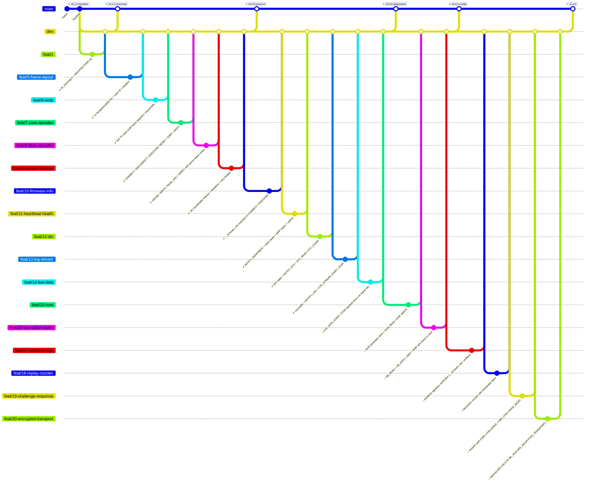

<!--
  Auto-generated from .github/roadmap.yaml by
  .github/scripts/render_roadmap.py. Do not edit this file directly —
  changes will be overwritten on the next run of the `Render ROADMAP`
  workflow. Edit the YAML or close / reopen a tracking issue instead.
-->

# Bootloader roadmap

Production roadmap for the STM32H733 CAN bootloader. Each phase is a
cluster of feat branches cut from `dev`; a milestone tag on `main`
closes the phase once every branch in it has merged. Branch status
badges (✅ / 🔄 / 🔜) are derived from each branch's tracking issue
state in GitHub Issues.

## Phase summary

| Phase | Title | Branches | Milestone tag |
|:---:|---|---|---|
| 1 | Memory map & firmware contract | ✅ done `feat/1` | `v0.1.1-memmap` |
| 2 | Protocol rewrite (classic CAN) | ✅ done `feat/5-frame-layout` · ✅ done `feat/6-isotp` · ✅ done `feat/7-core-opcodes` · ✅ done `feat/8-flash-opcodes` · ✅ done `feat/9-session-timeout` | `v0.2.0-protocol` |
| 3 | Firmware contract & diagnostics | ✅ done `feat/10-firmware-info` · ✅ done `feat/11-heartbeat-health` · ✅ done `feat/12-dtc` · ✅ done `feat/13-log-stream` · 🔜 planned `feat/14-live-data` | `v0.3.0-diagnostics` |
| 4 | Config & option bytes | 🔜 planned `feat/15-nvm` · 🔜 planned `feat/16-wrp-option-bytes` | `v0.4.0-config` |
| 5 | Security | 🔜 planned `feat/17-ed25519-sign` · 🔜 planned `feat/18-replay-counter` · 🔜 planned `feat/19-challenge-response` · 🔜 planned `feat/20-encrypted-transport` | `v1.0.0` |
| — | Workflow polish _(sidequest)_ | ✅ done `feat/2-autoclose-on-dev-merge` · ✅ done `fix/1-workflow-titled-branches` · ✅ done `feat/3-roadmap` · ✅ done `feat/4-roadmap-header-config` | — |

## Branch diagram

---

## How this file is maintained

- **Source of truth**: [`.github/roadmap.yaml`](.github/roadmap.yaml)
- **Renderer**: [`.github/scripts/render_roadmap.py`](.github/scripts/render_roadmap.py)
- **Workflow**: [`.github/workflows/roadmap.yml`](.github/workflows/roadmap.yml)

The workflow runs on every push to `dev`. If any branch status changed
(a tracking issue was closed, the YAML was edited, a new branch was
added) it regenerates this file and auto-commits with the message
`chore: regenerate ROADMAP.md [skip ci]`.
