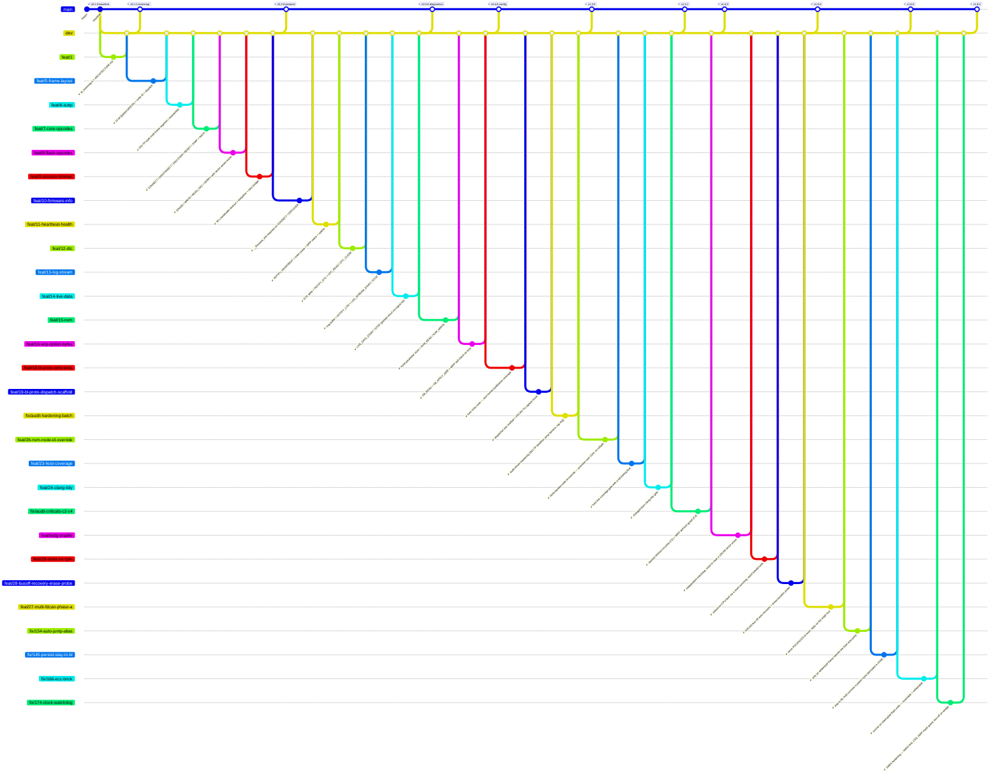

<!--
  Auto-generated from .github/roadmap.yaml by
  .github/scripts/render_roadmap.py. Do not edit this file directly —
  changes will be overwritten on the next run of the `Render ROADMAP`
  workflow. Edit the YAML or close / reopen a tracking issue instead.
-->

# Bootloader roadmap

Production roadmap for the STM32H733 CAN bootloader. Each phase is a
cluster of feat/fix branches cut from `dev`; a milestone tag on `main`
closes the phase once every branch in it has merged. Branch status
badges (✅ / 🔄 / 🔜) are derived from each branch's tracking issue
state in GitHub Issues.

Phases 1–4 build the bootloader to **v1.0.0** — feature-complete for
its intended use (internal tool, closed harness). v1.0.0 was the
*start* of a reliability arc, not the finish: phases 5–10 are the
six-release hardening run (v1.2.0 → v1.6.2) that turned it into a
brick-safe field tool — host-test scaffold + audit hardening, node-ID
provisioning, field-brick prevention, fault-operational recovery
(IWDG + bus-off + fault-reboot), multi-bus FDCAN, and finally the
500 kbps revert + ECC-brick recovery that closed the v1.6.0 brick
crisis. The current release is **v1.6.2** (see
[CHANGELOG.md](CHANGELOG.md)). Phase 11 (security) stays deferred
behind the `⏸ deferred` badge — picked up if scope ever expands to a
public or shared network.

## Phase summary

| Phase | Title | Branches | Milestone tag |
|:---:|---|---|---|
| 1 | Memory map & firmware contract | ✅ done `feat/1` | `v0.1.1-memmap` |
| 2 | Protocol rewrite (classic CAN) | ✅ done `feat/5-frame-layout` · ✅ done `feat/6-isotp` · ✅ done `feat/7-core-opcodes` · ✅ done `feat/8-flash-opcodes` · ✅ done `feat/9-session-timeout` | `v0.2.0-protocol` |
| 3 | Firmware contract & diagnostics | ✅ done `feat/10-firmware-info` · ✅ done `feat/11-heartbeat-health` · ✅ done `feat/12-dtc` · ✅ done `feat/13-log-stream` · ✅ done `feat/14-live-data` | `v0.3.0-diagnostics` |
| 4 | Config & option bytes | ✅ done `feat/15-nvm` · ✅ done `feat/16-wrp-option-bytes` | `v0.4.0-config` |
| 5 | Reliability & observability hardening | ✅ done `feat/18-bl-proto-wire-tests` · ✅ done `feat/19-bl-proto-dispatch-scaffold` · ✅ done `fix/audit-hardening-batch` | `v1.2.0` |
| 6 | Node-ID provisioning & CI gates | ✅ done `feat/26-nvm-node-id-override` · ✅ done `feat/23-host-coverage` · ✅ done `feat/24-clang-tidy` | `v1.3.1` |
| 7 | Field-brick prevention | ✅ done `fix/audit-criticals-c2-c4` | `v1.4.0` |
| 8 | Fault-operational hardening | ✅ done `feat/iwdg-enable` · ✅ done `feat/29-reset-on-spin` · ✅ done `feat/28-busoff-recovery-erase-probe` | `v1.5.0` |
| 9 | Multi-bus FDCAN & fleet cutover | ✅ done `feat/27-multi-fdcan-phase-a` · ✅ done `fix/154-auto-jump-alias` · ✅ done `fix/145-persist-stay-in-bl` | `v1.6.0` |
| 10 | 500 kbps & ECC-brick recovery | ✅ done `fix/166-ecc-brick` · ✅ done `fix/174-clock-watchdog` | `v1.6.2` |
| 11 | Security _(deferred)_ paused — internal tool, physical-perimeter security is sufficient for current scope; reactivate if deployment model changes | ⏸ deferred `feat/17-ed25519-sign` · ⏸ deferred `feat/18-replay-counter` · ⏸ deferred `feat/19-challenge-response` · ⏸ deferred `feat/20-encrypted-transport` | `—` |
| — | Workflow polish _(sidequest)_ | ✅ done `feat/2-autoclose-on-dev-merge` · ✅ done `fix/1-workflow-titled-branches` · ✅ done `feat/3-roadmap` · ✅ done `feat/4-roadmap-header-config` | — |

## Branch diagram

---

## How this file is maintained

- **Source of truth**: [`.github/roadmap.yaml`](.github/roadmap.yaml)
- **Renderer**: [`.github/scripts/render_roadmap.py`](.github/scripts/render_roadmap.py)
- **Workflow**: [`.github/workflows/roadmap.yml`](.github/workflows/roadmap.yml)

The workflow runs on every push to `dev`. If any branch status changed
(a tracking issue was closed, the YAML was edited, a new branch was
added) it regenerates this file and auto-commits with the message
`chore: regenerate ROADMAP.md [skip ci]`.
